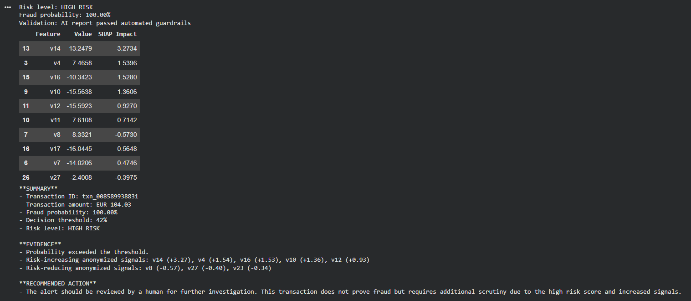
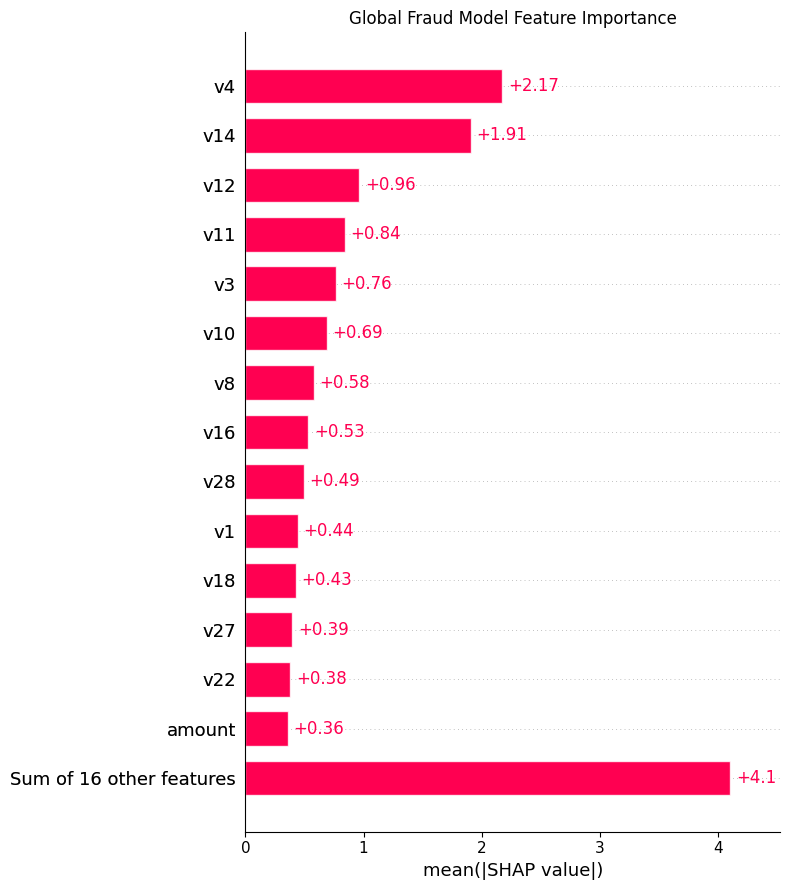
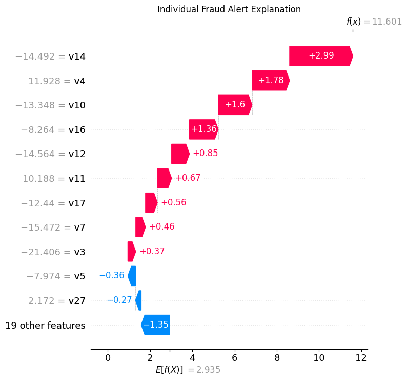
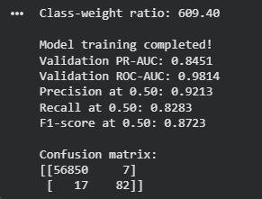
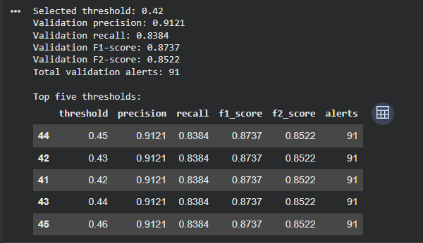
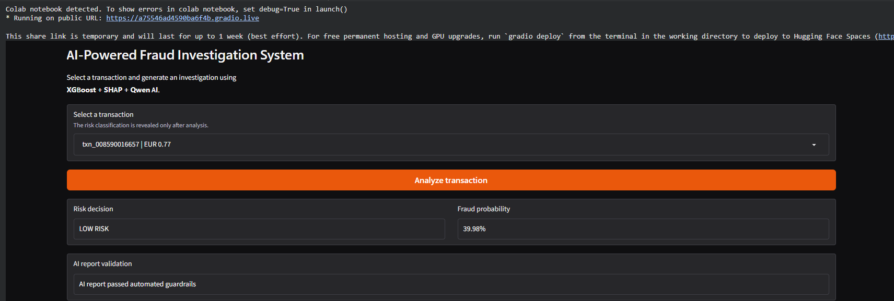

# AI-Powered Fraud Investigation System

An end-to-end fraud investigation system combining **PySpark data engineering, XGBoost, SHAP explainability and Qwen generative AI**.

The system detects suspicious credit-card transactions, explains the contributing signals and produces guarded investigation reports for human review.



## Project Results

| Metric | Result |
|---|---:|
| Transactions processed | 284,807 |
| Confirmed fraud records preserved | 492 |
| Validation PR-AUC | 0.8451 |
| Validation ROC-AUC | 0.9814 |
| Precision | 91.21% |
| Recall | 83.84% |
| F1-score | 87.37% |
| Selected decision threshold | 42% |

The threshold was selected to balance fraud detection with manageable alert volume.

## System Workflow

1. Process transaction data using PySpark.
2. Build Bronze, Silver and Gold data layers.
3. Preserve fraud records and prevent data leakage.
4. Train a class-weighted XGBoost classifier.
5. Select a fraud decision threshold.
6. Explain global and individual predictions using SHAP.
7. Generate investigation reports using Qwen.
8. Validate reports using automated guardrails.
9. Display results through a Gradio application.

## Explainable AI

### Global Feature Importance



### Individual Fraud Explanation



## Model Validation





## Application Examples

### High-Risk Transaction


### Low-Risk Transaction



## Technology Stack

- Python
- PySpark
- Pandas and NumPy
- XGBoost
- Scikit-learn
- SHAP
- Qwen
- Hugging Face Transformers
- Gradio
- Google Colab

## Repository Structure

```text
ai-fraud-investigation-system/
├── 01_Fraud_Data_Pipeline.ipynb
├── 02_Fraud_Model.ipynb
├── requirements.txt
├── images/
└── README.md
```

## Running the Project

1. Open `01_Fraud_Data_Pipeline.ipynb` in Google Colab and run all cells.
2. Run `02_Fraud_Model.ipynb` after the pipeline artifacts are created.
3. Select a T4 GPU before loading Qwen.
4. Run the Gradio application cell.
5. Select a transaction and click **Analyze transaction**.

## Important Note

This is an educational portfolio project using anonymized transaction data. Fraud probabilities support investigation prioritization but do not independently prove fraud. Final decisions should include human review.

## Author

**Shilpa Siddharaju**  
M.Sc. Data Science  
Berlin, Germany
